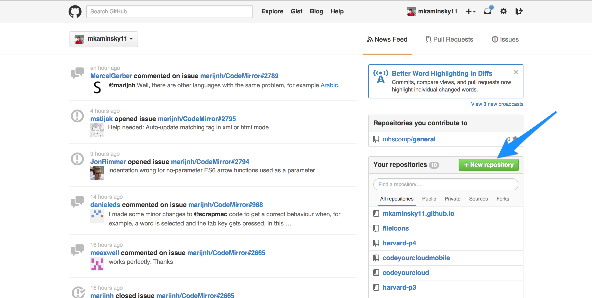
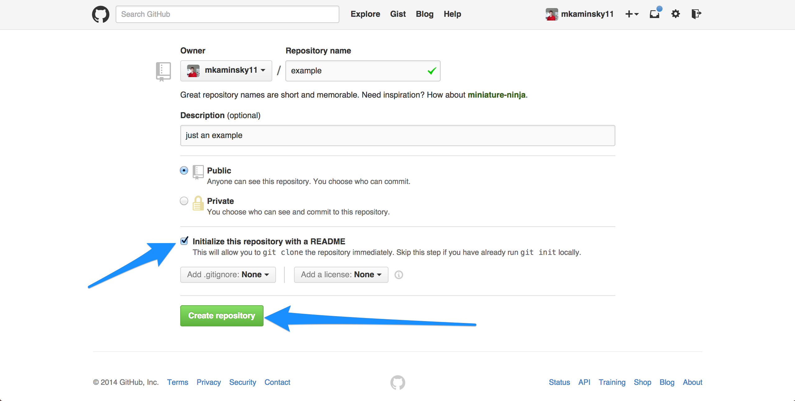
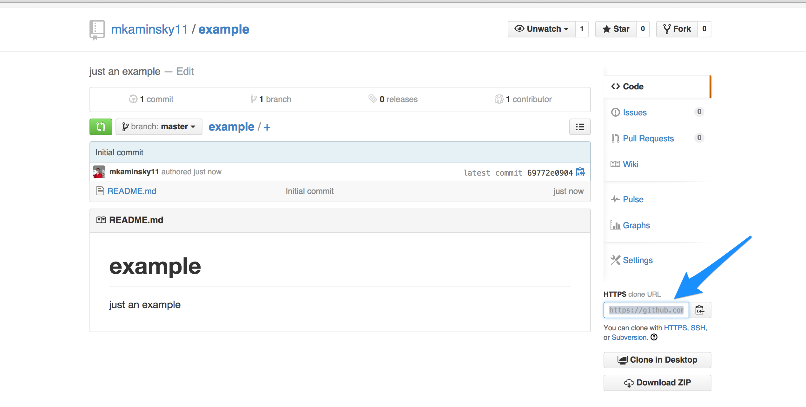
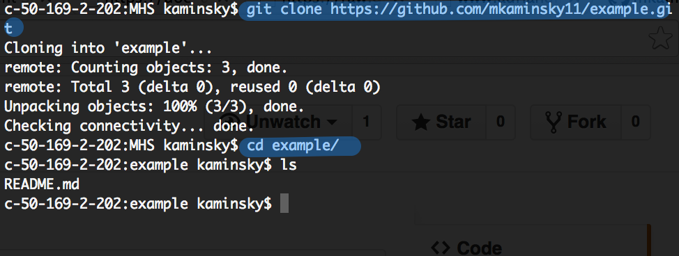
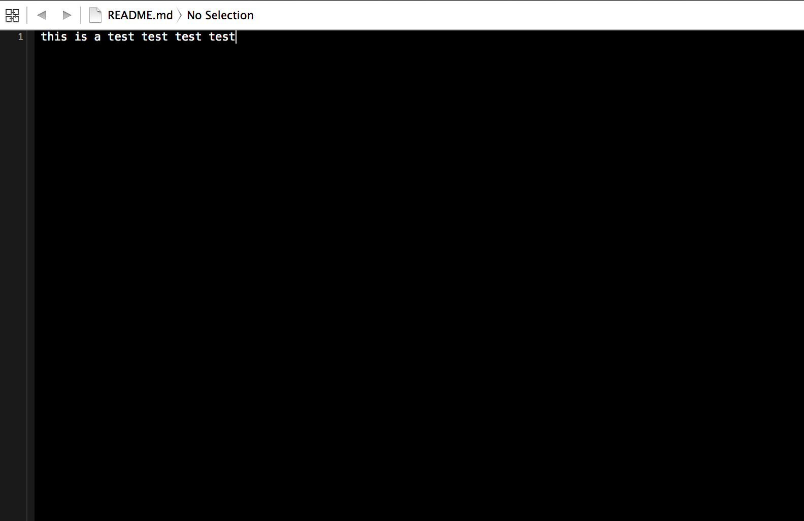
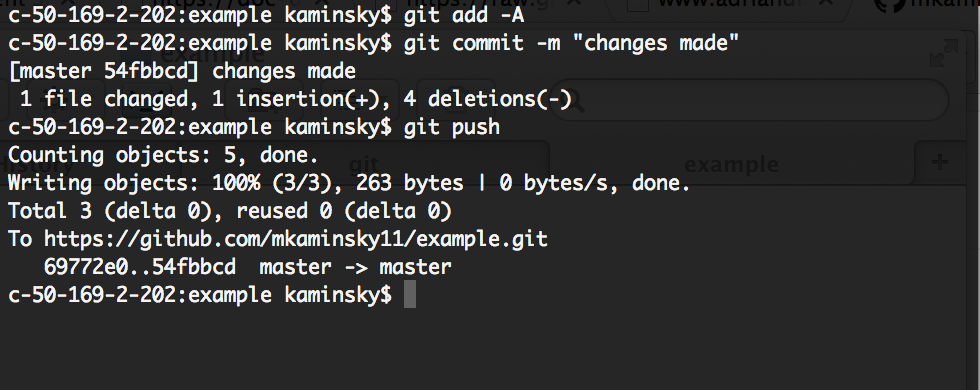
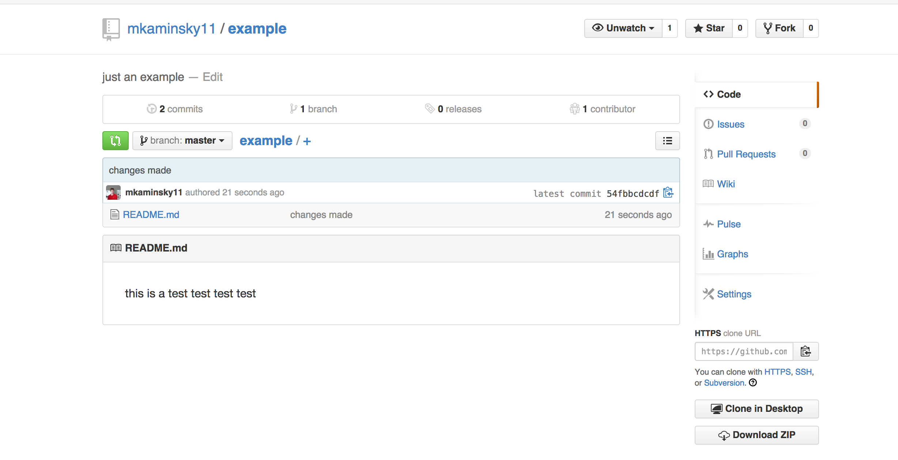

#MHS Robotics Club: GIT#

First, go to Github and click "New Repository".

Add a name, description, and check the box that says "initialize with README". "REAMDE" refers to "README.md", while forms the text that you see when you access the repository on GitHub and often contains a description of the project.

Copy the link to the right side of the screen.

In your command line, clone the repository, and move "into" the newly created folder. In this example `ls` lists the files in the folder.

Then, make some changes. For this example, I changed the text of "README.md".

Then, push all of the changes.

Then, verify that it worked.

<b>Wrap-Up</b> 
If you have completed the example and achieved this result, you have learned the basics of git. It will come up very often in your projects, so take the time to refresh your skills often.