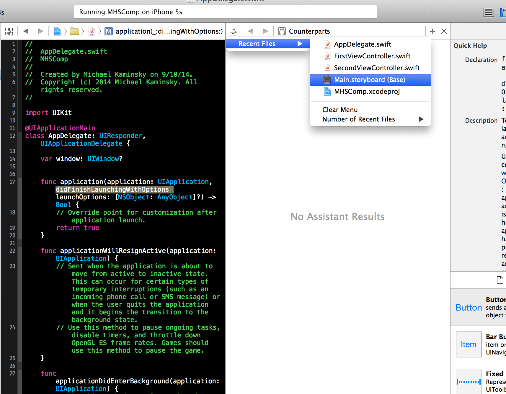

#MHS Robotics Club: iOS Development#

<b>Adding a button</b> 
Drag a button onto the space freed up by removing the label earlier.

Then, open up `AppDelegate.swift`. It's useful to know that the function `didFinishLaunchingWithOptions()` is launched when the app starts, and is where your code should go.

Finally click on the small icon that looks like a tuxedo. This is the "assistant menu". 

Hover over the icon that looks like 4 squares and click on `Main.storyboard`. 

Then, open up `FirstViewController.swift` since, this is what controls the view the button is located in.

Then, click on the button, hold the `control` key, and drag it over to the top of the file

A small popup will appear. Fill in the "name" field with "theButton".

<b>Next Step: <a href="trigger.md">Triggering actions</a></b>
