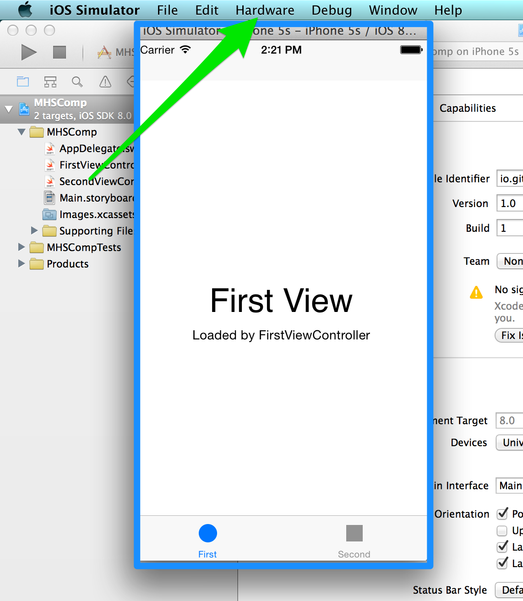
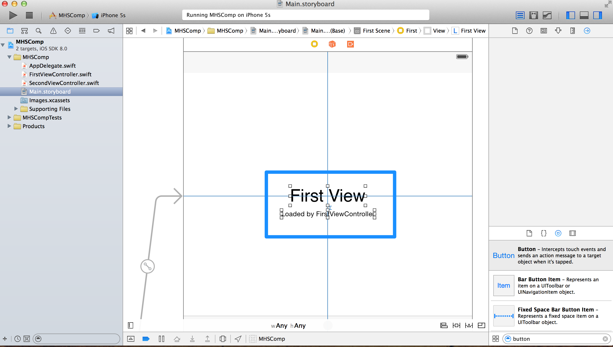
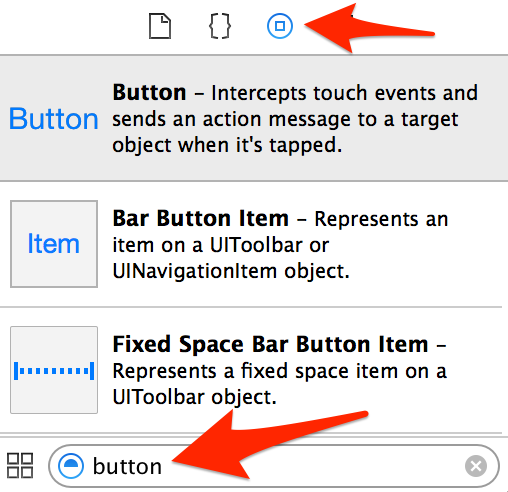

#MHS Robotics Club: iOS Development#

<b>Running a project</b> 
To run the project, just click the button at the top-left hand corner of the screen.

This will open up simulator with the app running. Try it now to see the sample tab-based application.

You can now see the simulator running the application. This can be interacted with just as if it was an actual iPhone. The "Hardware" menu allows you to change the simulator (to an iPad mini, for example), rotate it, "shake" it, or press the home button.

<b>Adding elements</b> 
Now, open up `Main.storyboard`. Drag with two fingers until you find the panel labeled "First View".

Delete the two labels. We will be replacing them with something else.

Notice the panel at the bottom right corner. 

Make sure the "home button" icon is selected. Then, search for "button". We will be adding one in the next section.

<b>Next Step: <a href="add.md">Adding elements</a></b>
