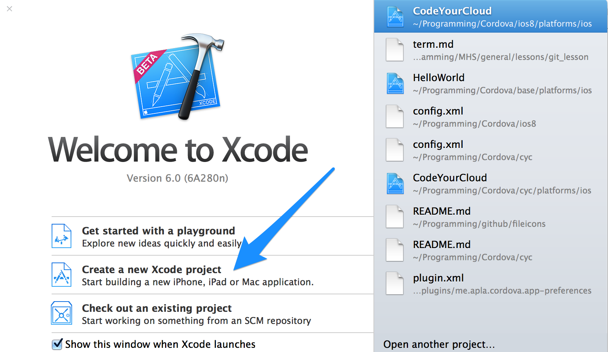
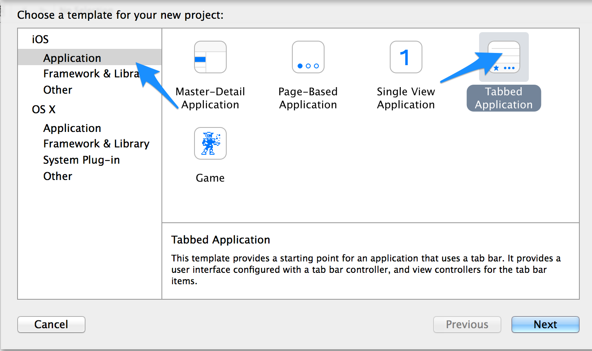
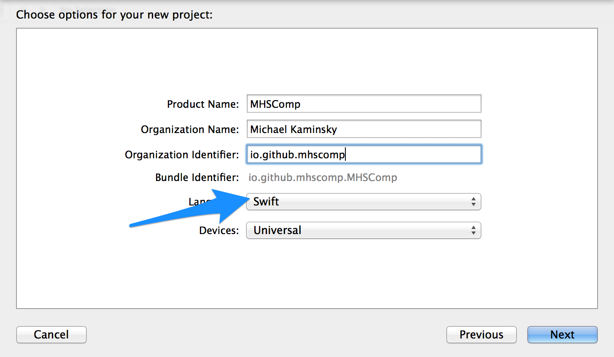
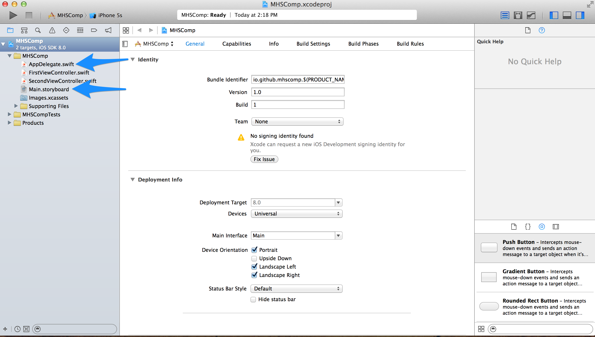

#MHS Robotics Club: iOS Development#

<b>Creating A Project</b> 
First, open up Xcode, and create a new project.

Create an iOS application. Then, choose "tab-based application". This is just preset that provides a starting point for the project.

The rest of the information doesn't matter, except that  "swift" is selected for the language.

Choose a place to save the file, and you will be presented with the main screen. `AppDelegate.swift` is the main file. `Main.storyboard` is where the user interface can be edited (you'll see what that means later).

<b>Next Step: <a href="run.md">Running</a></b>
