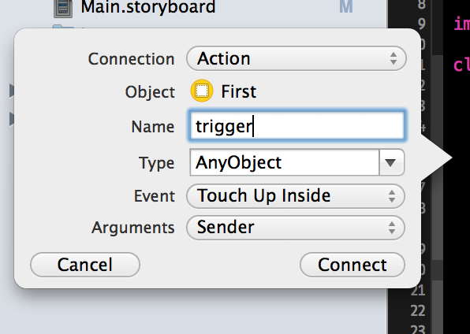
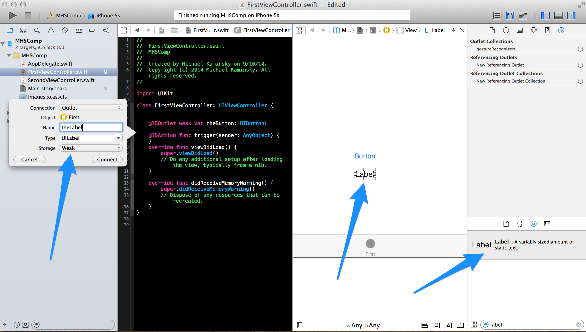
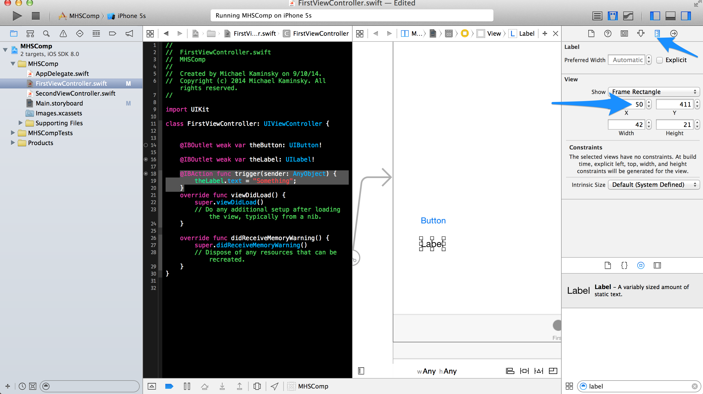
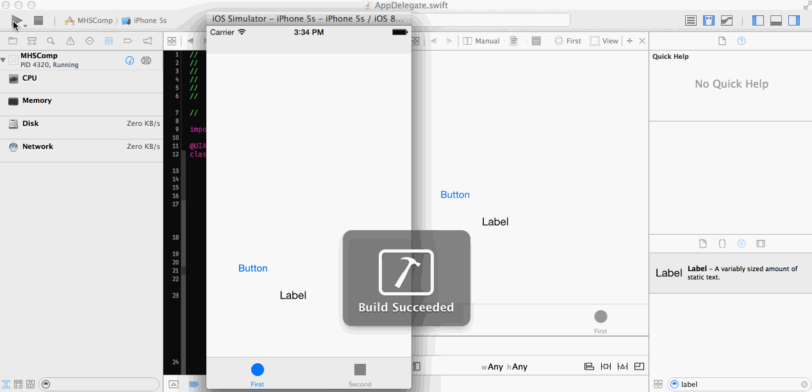

#MHS Robotics Club: iOS Development#



<b>Add An Action</b><br/>

Next, `ctrl+drag` the button again. This time, fill out the popup as shown. Instead of an `outlet` which simply tells the code that there is a button (and names it `theButton`), and `action` links an event triggered by the button (in this case `Touch Up Inside`) to a function.

<b>Add a Label</b><br/>

Go back to the storyboard and add a label below the button. Then connect it to `FirstViewController.swift` as you did with the button, naming it `theLabel`. 



Make the `trigger()` function look like this:

```swift
@IBAction func trigger(sender: AnyObject){
    theLabel.text = "Something";
}
```

It's pretty simple. It should change the text of `theLabel` to "something".

<b>Visual Prep</b><br/>

Adjust the x-coordinates of the button and label so it will fit better onto an iPhone.



<b>Testing it</b><br/>
Now, run it. If you've done everything correctly, it should look something like this:



<b>Next Step: <a href="trigger.md">Triggering actions</a></b>
