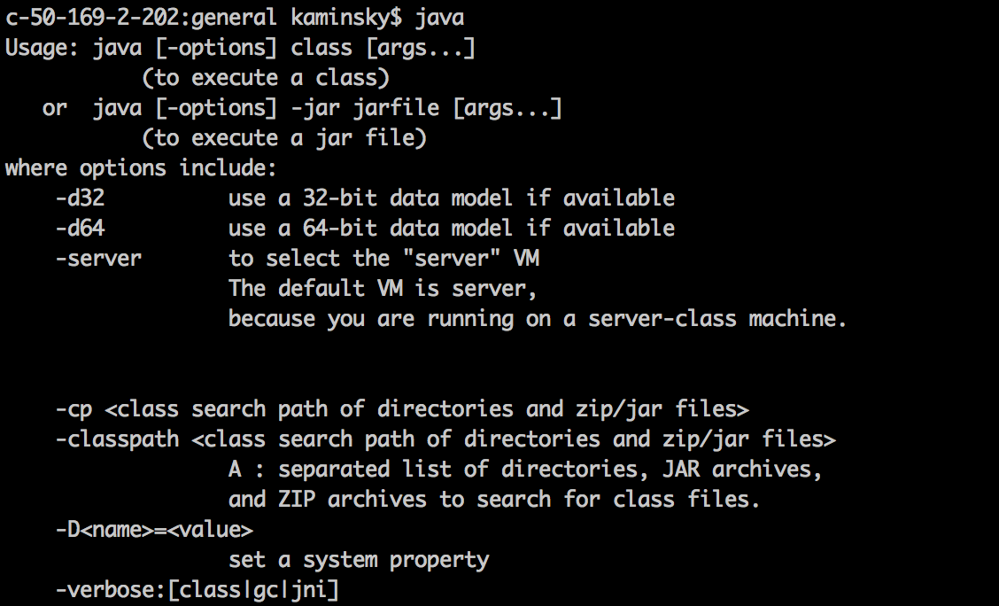
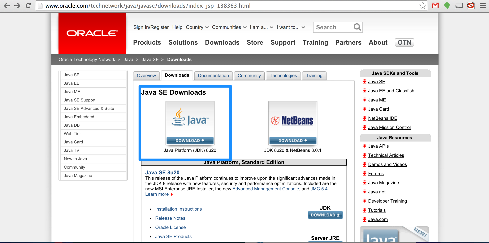

#MHS Robotics Club: Java Development#

<b>Installation Check</b> 
First, open up your terminal or command prompt and type in `java`. If you see an output, <a href="basic.md">skip this step</a>.

Otherwise, you'll have to install the Java JDK (Java development kit).

<b>For Mac</b> 
Go [here](http://www.oracle.com/technetwork/java/javase/downloads/index-jsp-138363.html) and click on "Download".

Once everything appears to be installed, close your terminal and reopen it. Then, try entering `java` again. If there is an output like the one above, you're good to go.

<b>For Windows</b> 
This is a little bit more complicated.

Go [here](http://www.oracle.com/technetwork/java/javase/downloads/index-jsp-138363.html) and click on "Download".

Run the file, and the Java JDK should install. _But that's not all!_ 

1. First, click on the Start button
2. Enter the control panel
3. Click advanced, then Environmental Variables
4. Find the `PATH` variable, and edit it
5. Find the location in which Java has been installed on your computer. It should be something like `C:\Program Files\Java\jdk1.7.0\bin`
6. Copy this location at the beginning of the `PATH` variable, followed by a `;`
7. So at the end, the `PATH` variable should look like: `C:\Program Files\Java\jdk1.7.0\bin;blahblahblahblah`, where the "blah"s are what was already there

Try typing `java` into the command line again to see if it works. If it doesn't, look [here](http://www.kingluddite.com/tools/how-do-i-add-java-to-my-windows-path).

<b>Next Step: <a href="basic.md">Basic programs</a></b>