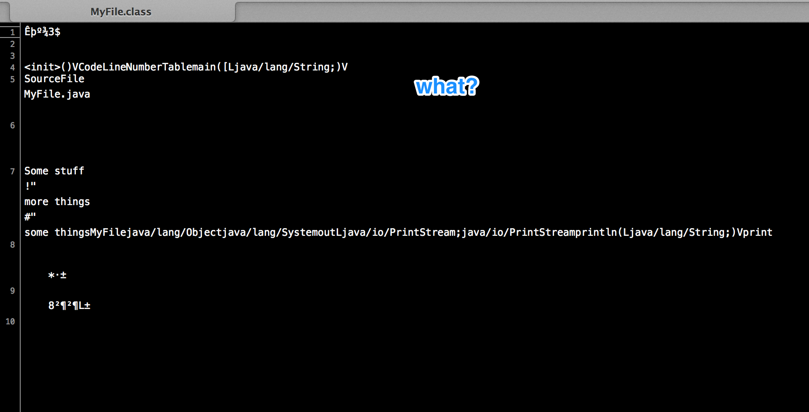
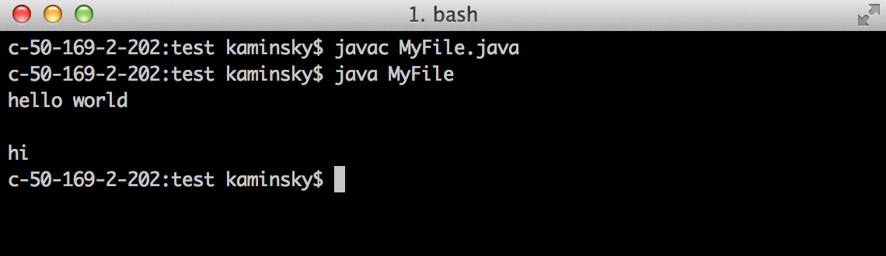
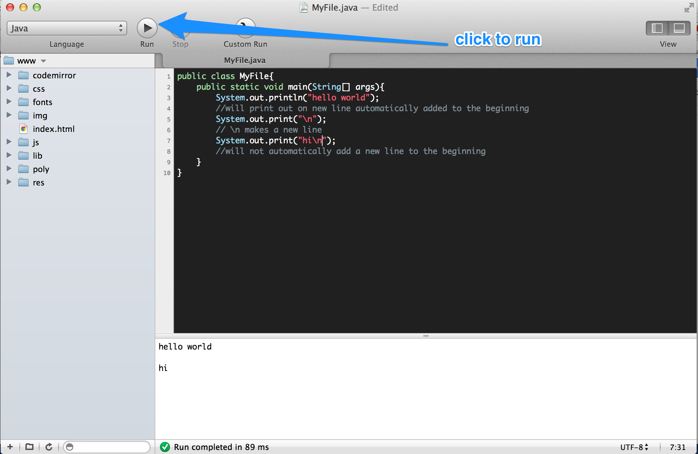

#MHS Robotics Club: Java Development#

<b>Steps</b><br/>
There are several steps to running java programs.

1. Write
2. Compile
3. Run
4. Repeat

<b>Compiling</b><br/>
Compiling will convert the `.java` file into a `.class` file. This file looks really bizarre (see below), but has encoded the instructions of the `.java` file into a format that a computer can understand.



To compile a `.java` file, you just use `javac name_of_file.java`. For example, if the file was `MyFile.java`, you would use `javac MyFile.java`.

<b>Running</b><br/>
Now you can run the `.class` file. This is done using the `java name_of_file` command, like `java MyFile`.

<b>Printing</b><br/>
One of the most basic skills needed is knowing how to print or log data. It will be shown once you run the file.

```java
public class MyFile{
    public static void main(String[] args){
        System.out.println("hello world");
        //will print out on new line automatically added to the beginning
        System.out.print("\n");
        // \n makes a new line
        System.out.print("hi\n");
        //will not automatically add a new line to the beginning
    }
}
```

Actually compiling and running this file:



If you make changes, you must compile it again for those changes to have an effect. Some programs, like CodeRunner, do the compiling for you. Example:




<b>Next Step: <a href="var.md">Variables</a></b>