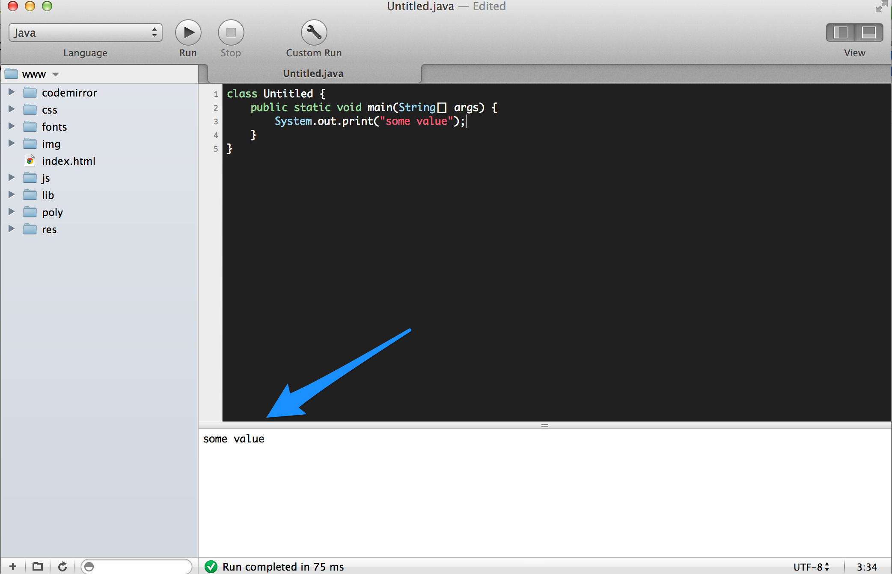

#MHS Robotics Club: Languages#

<b>Integer</b><br/>
This should be familiar from your math classes. It is a number with no decimal places.

```java
int some_int = 10; //java
```

```javascript
var some_int = 10; //javascript
```

```php
$some_int = 10; //php
```

<b>String</b><br/>
A string is a string of characters (a word or set of words).

```java
String some_string = "this is a string"; //java
```

```javascript
var some_string = "this is a string"; //javascript
```

```php
$some_int = "this is a string"; //php
```

```objective-c
NSString string = @"this is a string"; //objective c
```

<b>Double</b><br/>
A double is a number with a decimal

```java
double some_double = 10.1; //java
```

```javascript
var some_double = 10.1; //javascript
```

```php
$some_double = 10.1; //php
```

<b>Boolean</b><br/>
A boolean value has either a value of `true` or `false`;

```javascript
var bool = false; //javascript
```

<b>Method/Function</b><br/>
An operation that can return a value.

```javascript
//in javascript
function add(a, b){
    return a + b;
    //returns value
}

function talk(words){
    alert(words);
    //doesn't return anything
}
```

<b>Array</b><br/>
An array is a set of values that can be manipulated. Depending on the programming language, they are usually zero-indexed, so index 0 will be the first element, index 1 the second, etc.

```javascript
//javascript
var a = ["value 1", "value 2"];

console.log(a[0]); //will print "value 1"
```

<b>Log</b><br/>
To "log" a value is to print it out to some sort of console where you can see the output.

```java
//java
System.out.println("some value");
//you will see "some value" in the console
```



<b>Server</b><br/>
A server is simply a computer (as opposed to a web browser). This can be your own computer, or a remote one.

<b>Server-side</b><br/>
Server side code runs on a server, and can be used to coordinate the actions of many clients (users). For example, Facebook's servers may use PHP (a server-side language) to coordinate the chats of many different users on many different web browsers. Server-side languages preform much of the "grunt work" and are used to manage databases.

An important thing to note is that users cannot edit or see server-side code. This helps to prevent hackers from finding out how your code works, or from changing your databases. Server-side scripts can communicate with client-side code using a variety of methods.

Server-side langauges include C++, Java, PHP, Python, and Ruby on Rails.


<b>Client-side</b><br/>
Client-side code runs in a web browser. It's typically supposed to be faster and smaller than server-side code, as it has to re-run whenever a page is refreshed. It doesn't store anything permenant.

Client-side code can request information from a server, and can also recieve responses.

The main client-side language is Javascript.

A good post explaining the differences between client and server side code is located <a href="http://programmers.stackexchange.com/questions/171203/what-are-the-difference-between-server-side-and-client-side-programming">here</a>.

<b>Database</b><br/>
Think of it as an Excel spreadsheet that can be read and edited by server-side code.

<b>HTTP</b><br/>
HTTP is a protocol with which client and server side code can communicate. Think of browsers and servers are people. If the data is <i>what</i> there're saying, HTTP is <i>speech itself</i>. It's how the data is transferred.

This is done through several functions, including `POST` and `GET`.

<b>Onwards!</b>
<i>Option 1: <a href="server.md">Server-side languages</a></i><br/>
<i>Option 2: <a href="client.md">Client-side languages</a></i><br/>
<i>Option 3: <a href="compile.md">Compiling Languages</a></b><br/>
<i>Option 4: <a href="other.md">Other languages</a></i><br/>
<i>Option 5: <a href="mobile.md">Mobile Languages</a></i>

