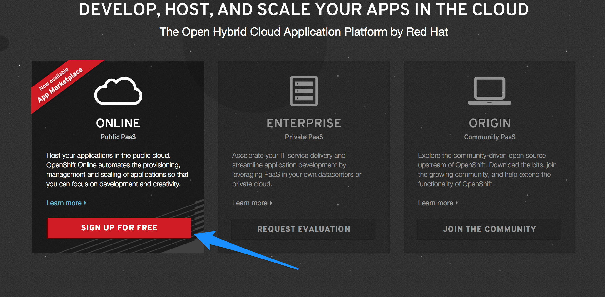
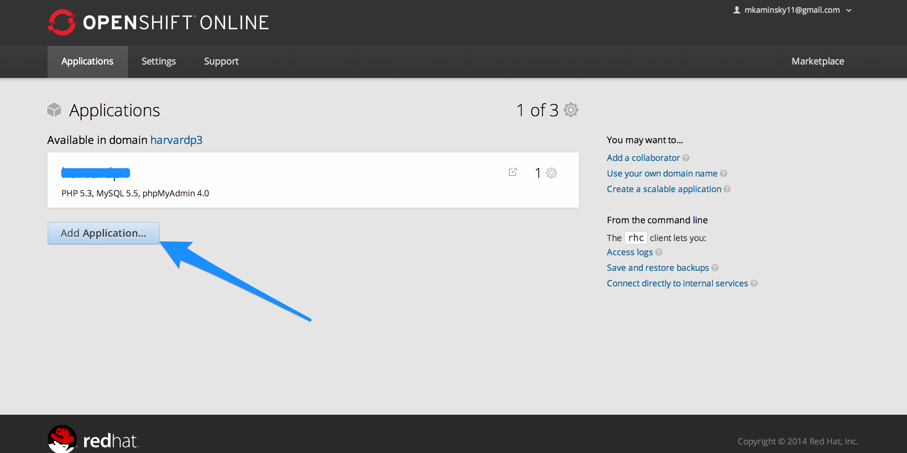
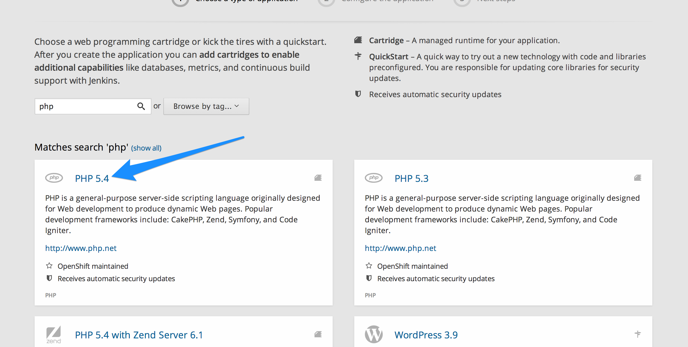
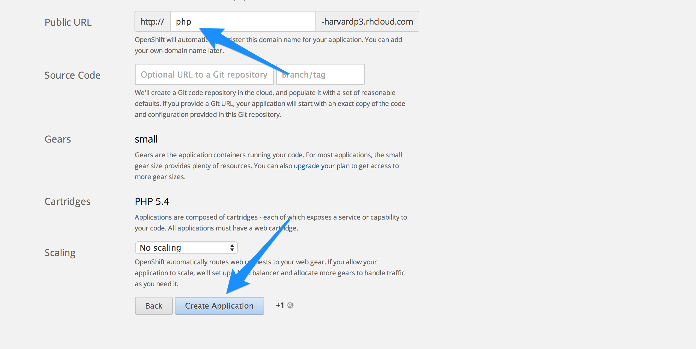

#MHS Robotics Club: OpenShift#

<b>Sign Up</b> 
First, go to <a href="https://www.openshift.com/">openshift.com</a> and select "Online".

After creating an account, add an application.

<b>Configure Your Application</b> 

In the "choose type of application" section, search for `php` and select `php 5.4`.

Then, choose a name for your application and create it.

<b>Next Step: <a href="use.md">Using Openshift</a></b>