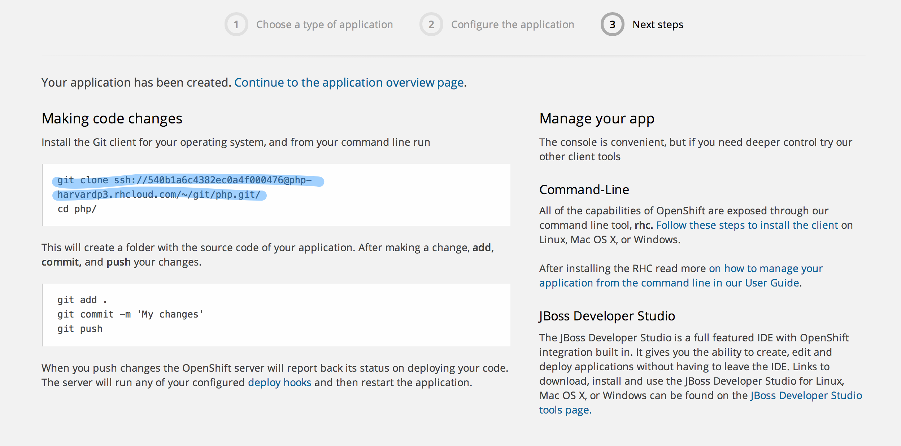
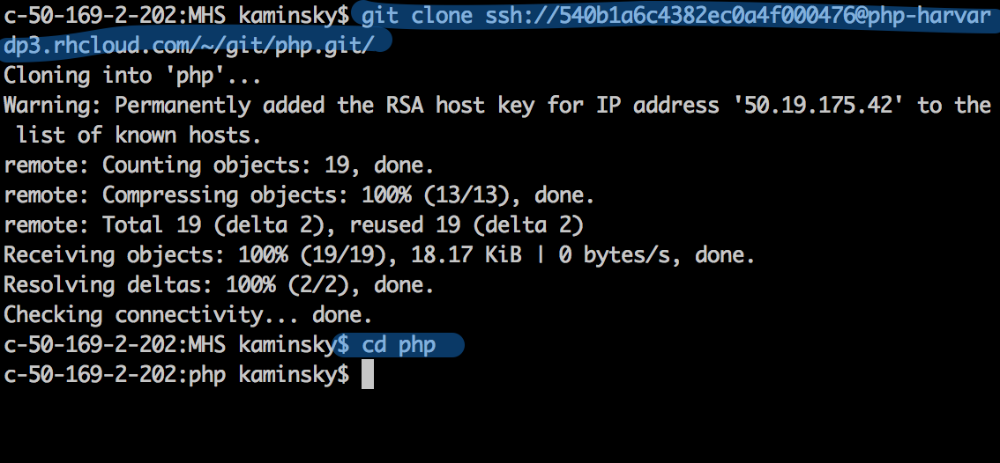
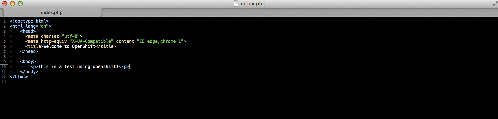
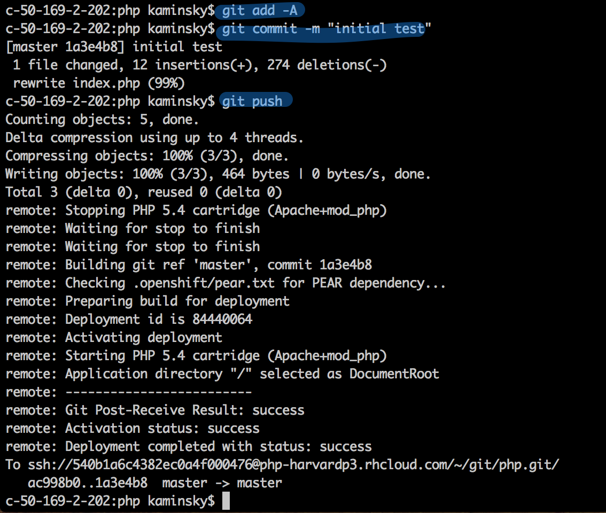

#MHS Robotics Club: OpenShift#

<b>Cloning the repo</b> 
All of the code is contained in a hidden git repository. The page that you see after the application has been created will tell you how to clone it.

Then, move into the newly created folder using `cd php`.

Then, make a change to the `index.php` file. This is the main file, and is what anyone visiting `php-harvardp3.rhcloud.com` (in this example) will see.

Finally, add, commit, and push the changes. This will take a while, because in addition to changing the code on the server, it also restarts `php` and any other cartidges so the changes show up on the site.

<b>Next Step: <a href="test.md">Testing</a></b>