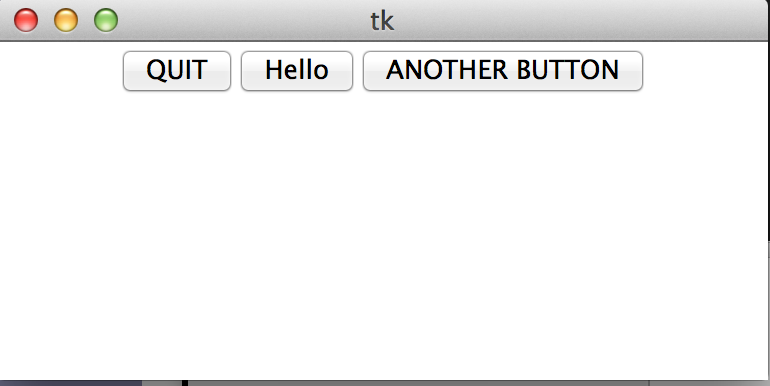

#MHS Robotics Club: Python#

**Learning the basics**<br/>
I highly recommend [code academy](http://www.codecademy.com/en/tracks/python) to learn the basics of python. Here's just a quick cheat sheet

**Functions**<br/>
```python
def add(a,b):
    return a + b
```

**Variables**<br/>
```python
some_variable = "something"
some_int = 1
some_number = 1.1
```

**Printing**<br/>
```python
print "hello world"
```

**What this document is for**<br/>
We'll be covering GUI (Graphic User Interface) with Python. This means making desktop applications with Python, so you can do stuff like this:



Using just python. It's pretty cool. To do this, you first need to install `Tkinter`. To test if you already  have it, try running this program.

`test.py`
```python
from Tkinter import *
```
 And then run it

`python test.py`

If this runs without errors, you're good to go. Otherwise, [install Tkinter](http://tkinter.unpythonic.net/wiki/How_to_install_Tkinter).

**Next Step: [creating a window](window.md)**
