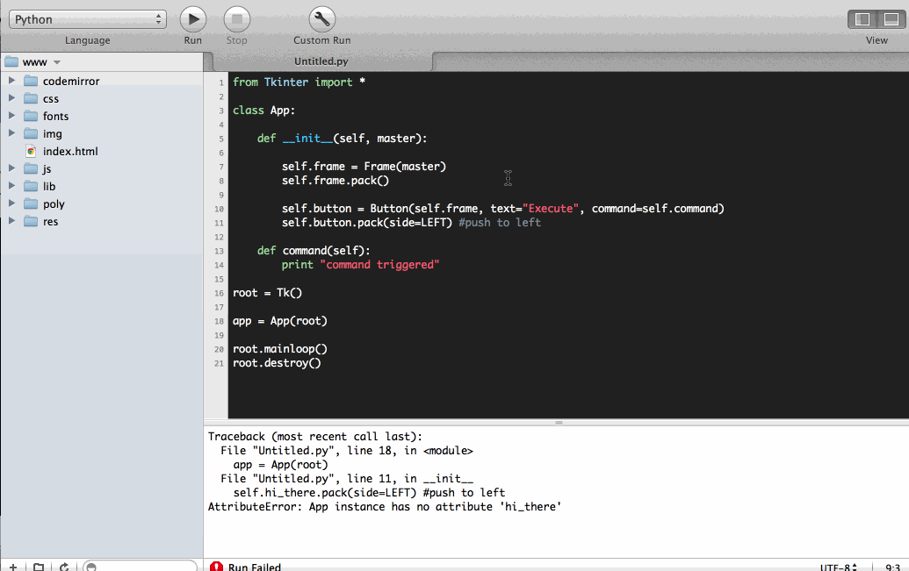
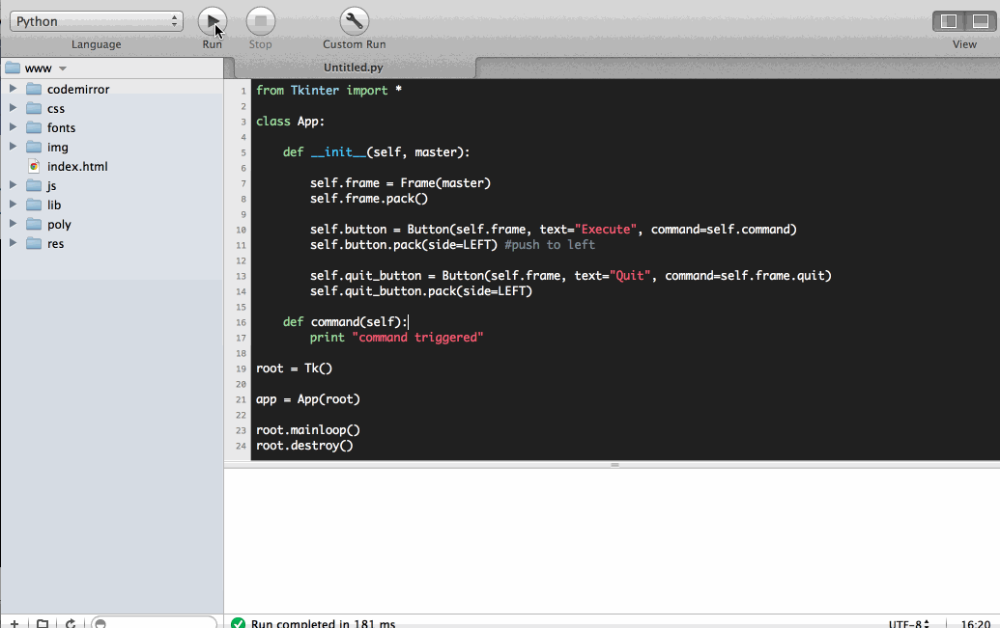

#MHS Robotics Club: Python#

**Commands**<br/>
If you want to give a button a command, you have to declare it as a function.

```python
from Tkinter import *

class App:

	def __init__(self, master):

		#blah blah blah

	def some_command(self):
	    #this can be referenced using self.some_command()

root = Tk()

app = App(root)

root.mainloop()
```
**Creating a button**<br/>
Next, add the buttons.

```python
from Tkinter import *

class App:

	def __init__(self, master):

		self.frame = Frame(master)
		self.frame.pack()
		
		self.button = Button(self.frame, text="Execute", command=self.command)
		self.button.pack(side=LEFT) #push to left

	def command(self):
		print "command triggered"

root = Tk()

app = App(root)

root.mainloop()
root.destroy()
```



**Closing the window**<br/>
The window can be closed using `self.frame.quit`.

```python
from Tkinter import *

class App:

	def __init__(self, master):

		self.frame = Frame(master)
		self.frame.pack()
		
		self.button = Button(self.frame, text="Execute", command=self.command)
		self.button.pack(side=LEFT) #push to left
		
		self.quit_button = Button(self.frame, text="Quit", command=self.frame.quit)
		self.quit_button.pack(side=LEFT)

	def command(self):
		print "command triggered"

root = Tk()

app = App(root)

root.mainloop()
root.destroy()
```



**Next Step: [Inputs](inputs.md)**
