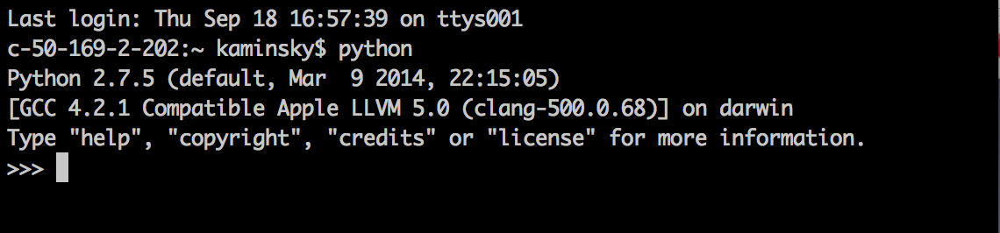

#MHS Robotics Club: Python#

**Do You Already Have It?**
First, open up your terminal/command line, and run `python`. If this appears:

You're [good to go](basics.md)! Just type in `exit()` first. Otherwise, continue.

**For Windows**
Download it [here](https://www.python.org/downloads/windows/) or and see more information [here](https://www.python.org/download/windows/).

**For Mac**
It's already installed :) by default. For more information, go [here](https://www.python.org/download/mac).

**Next Step: [the basics](basics.md)**
