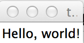

#MHS Robotics Club: Python#

**Classes**
The App will be build on a class called "app". A class can be assigned different values that can be assigned different values.

To make a label:
```python
from Tkinter import *

class App:

	def __init__(self, master):
        
        #this is the start of the class

		self.frame = Frame(master)
		self.frame.pack() #this will resize the window to fit its contents
		
		self.label = Label(self.frame, text="Hello, world!")
		
		self.label.pack() #will pack it
		

root = Tk()

app = App(root)

root.mainloop() #this starts the window
root.destroy() 
```

Running this:



**Next Step: [Buttons](buttons.md)**
